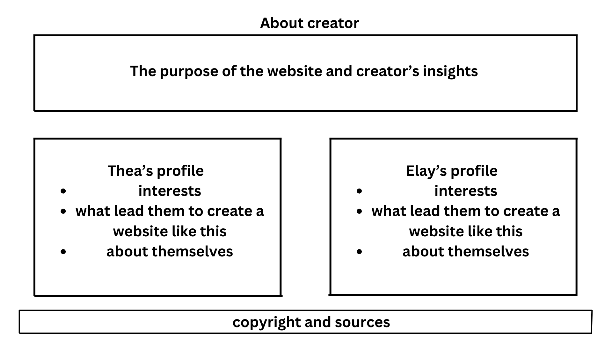
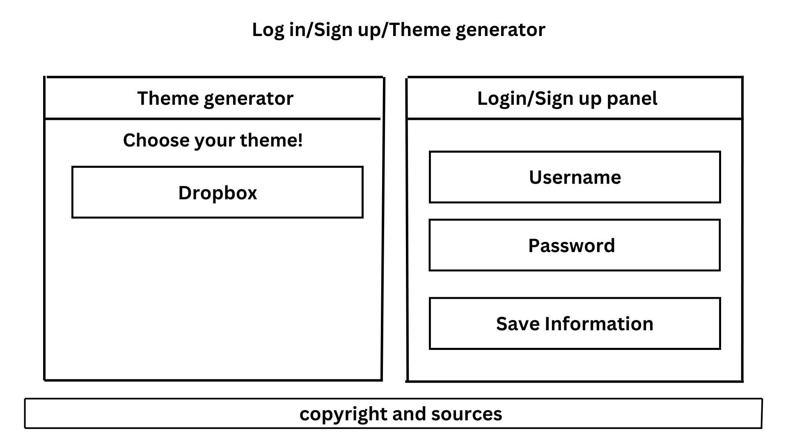

# Q4 Project Update Plan
**Summary**: These updates will include a change in code in a few pages of the website to ensure that the website works properly. For the case of _Customize_, its .js needs to include a function that'll save the room design to either _Drafts_ or _Collections_. The chosen favorites works in _Collections_ will be shown in _Bookmarks_ with a function as well.

Another type of update will be the addition of two new pages: (1) _About the Creators_ and (2) _Login/Signup & Theme Generator_. The first page will replace the Social Media page as its contents will transfer to the footer on every page while the second will ask for a username and password along with the user's preference, generating a room that fits their choice to give the website a game-like appearance.

1. About the Creators Page
Type of data: Text
Purpose: For users to familiarize with the creators of the site and understand the inspirations behind the project.
Structure in JSON format:

about_us {
"purpose": "Familiarize with the creators by reading the contents of this page as they share their interests and inspirations!",

"thea_interest": "Project Sekai, music, drawing, anime, true crime, history",

"thea_inspo": "We wanted to make this type of website since it's hard to rearrange a room if you don't have any inspiration for the theme of your room. In order to solve this problem, we decided to make a website wherein you can customize your own room.",

"thea_more": "Fav STEM subject: Bio because I hate computing",

"elay_interest": "F1, biking, adventures, pink, drawing, music",

"elay_inspo": "We wanted to make this type of website since it's hard to rearrange a room if you don't have any inspiration for the theme of your room. In order to solve this problem, we decided to make a website wherein you can customize your own room.",

"elay_more": text-string
}

 
   
2. Login/Signup & Theme Generator Page
Type of data: Drag-and-drop
Purpose: To ask for the user's interest in terms of style and aesthetic, this generator gives them an idea on which theme suits their liking the most
Structure in JSON format:

{theme [
{
"id": "Minimalist"
},
{
"id": "Vintage"
},
{
"id": "Coastal"
},
{
"id": "Luxury Glam"
},
{
"id": "Futuristic"
},
{
"id": "Anime/Pop Culture"
},
{
"id": "Dark Academia"
},
{
"id": "Cottagecore"
},
{
"id": "Fantasy/Fairy Tale"
},
{
"id": "Nature"
}
]}

3. Image sizing of existing photos
Type of data: Image source
Purpose: To make sure all images are scaled properly by resizing based on the image's raw dimensions
Structure in JSON format:

{
"src": name of image,
"width": measure in px,
"height": measure in px
}

4. Save contents of "Customize" to either "Drafts" or "Collections"
Type of data: Image source (src) as string, Position (left, top) as strings or numbers (px values)
Purpose: To store and retrieve customized room layouts, allowing users to bookmark and revisit their designs.
Structure in JSON format:
{
"src": "furniture1.png",
"left": "100px",
"top": "150px"
},

{
"src": "light2.png",
"left": "200px",
"top": "250px"
},

{
"src": "deco3.png",
"left": "300px",
"top": "350px"
}

5. Bookmark rooms from "Collections" to "Bookmarks"
Type of data: Image URL, String
Purpose: To easily navigate favorite room designs
Structure in JSON format:

{
"name": text-string,
"desc": text-string,
"image": image
},

{
"name": text-string,
"desc": text-string,
"image": image
}

6. Social media accounts on footer
Type of data: Structural/Footer
Purpose: Users can easily navigate social media accounts on every page.
Structure in JSON format:

{
"site": "X",
"url": "https://x.com/manage_czone",
"icon": image
},

{
"site": "GMail",
"url": "https://mail.google.com",
"icon": image
},

{
"site": "YouTube",
"url": "https://wwww.youtube.com/@ComfortZoneManagement",
"icon": image
}
